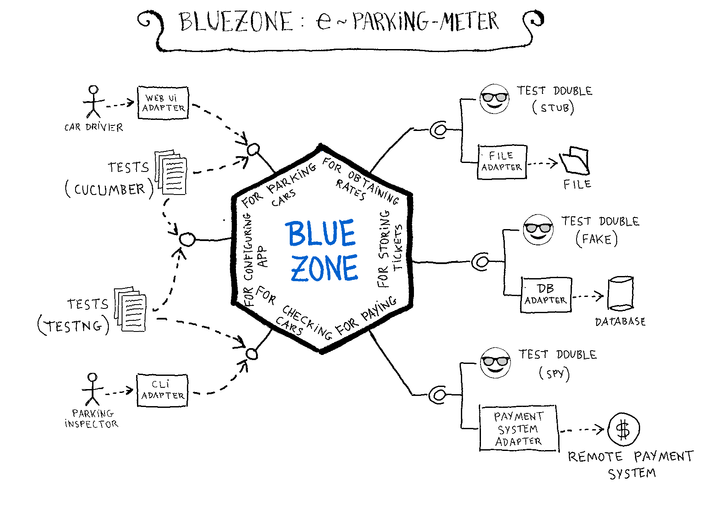

# BlueZone
## An example application implementing Hexagonal Architecture

See the article series: [https://jmgarridopaz.github.io/content/hexagonalarchitecture-ig/intro.html]

BlueZone allows car drivers to pay remotely for parking cars at regulated parking areas in a city, instead of paying with coins using parking meters.

When car drivers want to park their car, they have to get a parking permit, providing the ending datetime of the permit period. The starting datetime is the one at which the permit is requested. The application calculates the price of the permit, according to the number of minutes of the period, applying the rate of the area where the car is parked. Payments are done with cards, using a remote system.

Once car drivers have paid, the application issues the parking permit, that allows them to park the car during the period of time they have paid for. Permits are stored in a database.

Car drivers will access the application using a Web UI (User Interface).

At any time, parking inspectors can check whether a parked car doesn't have any active permit for the rate of the area the car is parked at.

Parking inspectors will access the application using a terminal with a CLI (Command Line Interface).

### Development environment:

- Java 9 (jdk-9.0.4)

- Maven 3.5.4

- Eclipse IDE 2019-12 (4.14.0)

- Ubuntu 18.04.5 LTS (Linux 5.4.0-48-generic)

### Compile and Run Instructions:

- Download and extract this github repo to a local directory on your computer ( `<bluezone_dir>` )

- Compile all modules (you need to do this just the first time before running):
  
  ~~~
  cd <bluezone_dir>
  ./scripts/build.sh
  ~~~

- Run hardcoded driver ports tests:
  
  ~~~
  cd <bluezone_dir>
  ./scripts/hardcodedhexagon/run_forparkingcars_test.sh
  ~~~
  
  ~~~
  cd <bluezone_root_dir>
  ./scripts/hardcodedhexagon/run_forcheckingcars_test.sh
  ~~~
